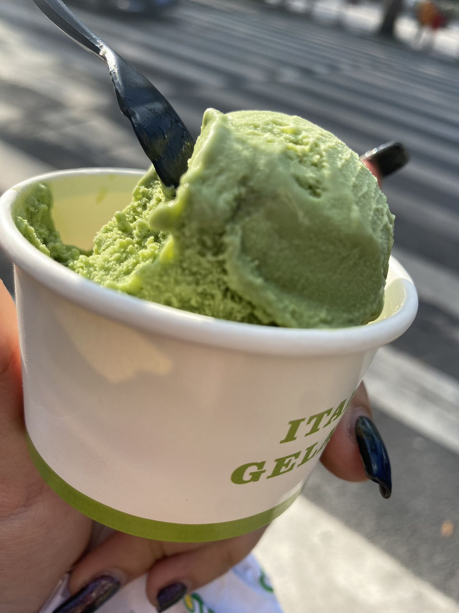

## About Me

**Hi, I am a first-year MS epidemiology student at Columbia University from Beijing, China.**

{height=300}

---

## Academic Life

**My research direction of interest are epidemiology, occupational hazards, immune damage, and methylation.**

**This is a little more about my academic life:
[Resume](resume.html)**

---

## Life outside research

**Here are a few photos that sum up most of my life and what I enjoy:**

*Lab Work!*

{height=400}

*Sweets and Food!*

{height=300}

{height=300}

*And Football!*

{height=300}

{height=300}

---

## HW Part 2 Dashboard

Instacart is an online grocery service that allows you to shop online from local stores. In New York City, partner stores include Whole Foods, Fairway, and The Food Emporium. Instacart offers same-day delivery, and items that users purchase are delivered within 2 hours.

A flexdashboard using plotly for that includes at least three distinct plot types for this dataset is made.

[Click here to view Dashboard ](instacart.html)